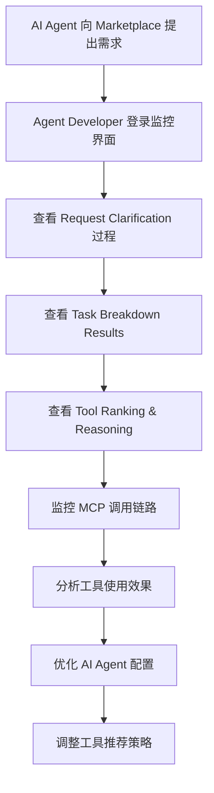
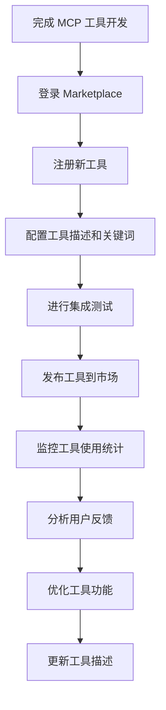
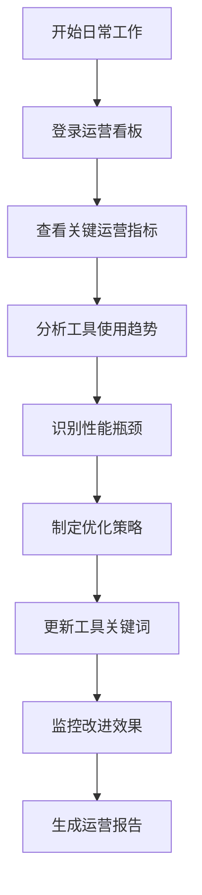
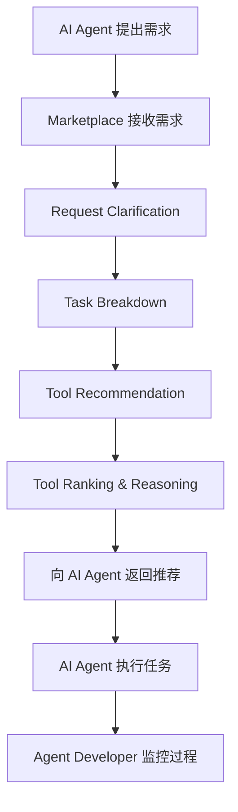
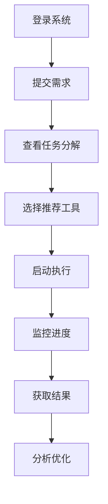
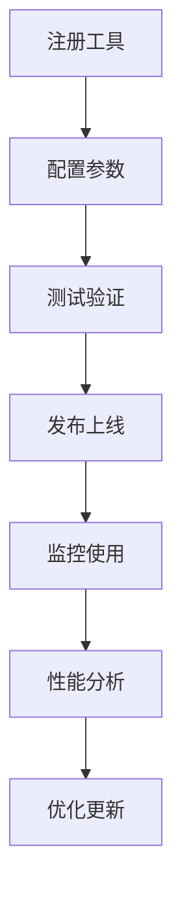
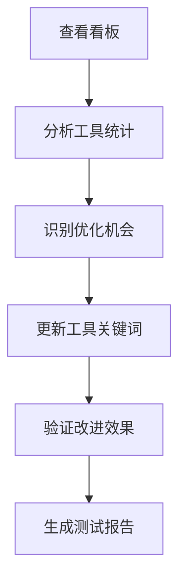

# Agent Marketplace UI 需求分析文档

## 1. 项目概述

### 1.1 项目背景
Agent Marketplace 是一个为 AI Agents 提供服务的智能平台，**直接用户是 AI Agents**，而 Agent Developers（人类）通过 UI 监控和管理他们的 AI Agents。

**核心工作流程**：
1. **AI Agent 提出需求** → Marketplace 接收并理解需求
2. **需求分析和任务分解** → Marketplace 将需求分解为可执行任务
3. **工具推荐和排序** → 为每个任务推荐并排序 MCP Tools
4. **向 Agent Developer 展示** → 通过 UI 展示整个过程和结果

**核心功能**：
- **MCP 工具集成**: 支持多种类型的 MCP 工具集成（YouTube、搜索、金融、办公套件等）
- **智能任务分解**: 将 AI Agent 的复杂需求分解为可执行的任务，支持关键词提取和子任务识别
- **工具推荐引擎**: 基于任务特征推荐合适的 MCP tools，并进行排序和原因说明
- **Request Clarification**: 向 Agent Developer 展示需求澄清过程
- **Task Breakdown Results**: 展示任务分解结果和对应查询
- **Tool Ranking & Reasoning**: 展示工具排序和推荐原因

### 1.2 项目目标
快速实现一个功能完整的 UI 界面，展现 marketplace 的核心功能，重点突出 critical user journey，支持三类主要用户角色的完整工作流程。

## 2. User Persona 和 Jobs to be Done

### 2.1 Agent 开发者 (Alex Chen)

#### Persona 特征
- **背景**: 5年经验的 AI 工程师，专注于开发智能代理系统
- **公司**: 中型科技公司，负责构建客户服务 AI agent
- **技术栈**: Python, LangChain, OpenAI API, 熟悉 MCP 协议
- **工作环境**: 远程工作，使用 MacBook Pro，管理多个 AI Agents

#### 目标和动机
- **主要目标**: 监控和管理多个 AI Agents，确保它们能够有效利用 Marketplace 服务
- **成功指标**: AI Agents 的任务完成率，工具推荐准确性，系统整体性能
- **痛点**: 缺乏对 AI Agents 使用 Marketplace 过程的可见性，难以优化 Agent 性能

#### Jobs to be Done
1. **JTBD #1**: 当我的 AI Agent 向 Marketplace 提出需求时，我需要查看需求澄清过程
2. **JTBD #2**: 当 Marketplace 分解任务时，我需要查看任务分解结果和对应查询
3. **JTBD #3**: 当 Marketplace 推荐工具时，我需要查看工具排序和推荐原因
4. **JTBD #4**: 当 AI Agent 执行任务时，我需要实时监控执行状态和 MCP 调用链路
5. **JTBD #5**: 当需要优化 AI Agent 性能时，我需要分析工具使用效果并调整配置

#### Critical User Journey


### 2.2 MCP Tool 开发者 (Sarah Johnson)

#### Persona 特征
- **背景**: 3年经验的全栈开发者，专注于 API 和工具开发
- **公司**: 工具开发公司，为 AI 生态系统提供专业工具
- **技术栈**: Node.js, Python, REST APIs, MCP 协议专家
- **工作环境**: 办公室工作，使用 Windows 开发环境，注重工具的可重用性

#### 目标和动机
- **主要目标**: 将开发的 MCP 工具推广给更多 AI agent 开发者使用
- **成功指标**: 工具使用频率，用户满意度，收入增长
- **痛点**: 缺乏有效的工具推广渠道，难以了解工具使用情况

#### Jobs to be Done
1. **JTBD #1**: 当开发新的 MCP 工具时，我需要将其注册到 marketplace 并配置描述信息
2. **JTBD #2**: 当工具需要更新时，我需要管理版本控制并通知用户
3. **JTBD #3**: 当需要了解工具使用情况时，我需要查看详细的使用统计和性能数据
4. **JTBD #4**: 当收到用户反馈时，我需要分析问题并优化工具功能
5. **JTBD #5**: 当需要推广工具时，我需要优化工具描述和关键词以提高推荐率

#### Critical User Journey


### 2.3 Marketplace 运营人员 (David Kim)

#### Persona 特征
- **背景**: 8年经验的产品运营经理，专注于数据驱动的产品优化
- **公司**: Agent Marketplace 平台运营团队
- **技术栈**: SQL, Python, 数据分析工具，熟悉 AI 生态系统
- **工作环境**: 办公室工作，使用多显示器设置，注重数据分析和决策支持

#### 目标和动机
- **主要目标**: 优化 marketplace 的整体性能和用户体验
- **成功指标**: 平台活跃度，工具使用效率，用户留存率
- **痛点**: 缺乏全面的运营数据，难以识别优化机会

#### Jobs to be Done
1. **JTBD #1**: 当需要了解平台整体运营状况时，我需要查看关键指标和趋势分析
2. **JTBD #2**: 当发现工具推荐不准确时，我需要分析原因并优化推荐算法
3. **JTBD #3**: 当需要提升平台性能时，我需要识别瓶颈并制定优化策略
4. **JTBD #4**: 当需要支持新用户时，我需要提供清晰的引导和帮助文档
5. **JTBD #5**: 当需要评估平台效果时，我需要生成详细的运营报告

#### Critical User Journey


## 3. Marketplace 工作流程详解

### 3.1 核心工作流程



### 3.2 详细步骤说明

#### 步骤 1: AI Agent 需求提交
- AI Agent 向 Marketplace 发送自然语言需求
- 需求示例："从微软雷德蒙德园区到最近沃尔玛的骑行时间"

#### 步骤 2: Request Clarification
- Marketplace 理解并澄清需求
- 识别需求的关键要素和约束条件
- 向 Agent Developer 展示澄清过程

#### 步骤 3: Task Breakdown
- 将复杂需求分解为可执行的子任务
- 生成任务分解结果和对应查询
- 向 Agent Developer 展示分解过程

#### 步骤 4: Tool Recommendation
- 基于任务特征推荐合适的 MCP Tools
- 考虑工具的功能匹配度和性能指标

#### 步骤 5: Tool Ranking & Reasoning
- 对推荐工具进行排序
- 提供推荐原因和匹配度分析
- 向 Agent Developer 展示排序逻辑

#### 步骤 6: 执行监控
- AI Agent 使用推荐工具执行任务
- Agent Developer 实时监控执行过程
- 追踪 MCP 调用链路和性能指标

### 3.3 UI 展示要求

**Agent Developer 需要看到的信息**：
1. **Request Clarification**: 需求澄清的详细过程
2. **Task Breakdown Results**: 任务分解结果和对应查询
3. **Tool Ranking & Reasoning**: 工具排序和推荐原因
4. **MCP Call Tracking**: MCP 调用链路追踪
5. **Performance Analytics**: 性能分析和优化建议

### 3.4 实际案例示例

#### 案例 1: 地图查询任务
**用户查询**: "从微软雷德蒙德园区 Building C 到最近沃尔玛的骑行时间"
- **关键词提取**: 位置、距离、交通方式
- **任务分解**: 地址解析 → 坐标转换 → 附近搜索 → 路线规划
- **推荐工具**: GoogleMap MCP, Location Search, Route Calculator

#### 案例 2: 复杂信息检索
**用户查询**: "Doctor Who 第9季第11集中迷宫场景的官方名称"
- **任务分解**: 剧集信息检索 → 脚本内容搜索 → 场景定位
- **推荐工具**: Wikipedia, Search, Wayback Archives

#### 案例 3: YouTube 内容处理
**用户查询**: "获取 Justin Bieber - Off My Face 的 Top 10 评论"
- **任务分解**: 视频搜索 → 评论提取 → 排序筛选
- **推荐工具**: YouTube ToolBox, YouTube Download

## 4. 用户痛点分析

### 4.1 Agent 开发者痛点
- **工具集成复杂**: 手动集成各种 MCP 工具耗时且容易出错
- **缺乏工具推荐**: 不知道哪些工具最适合特定任务
- **执行监控困难**: 难以实时了解 agent 执行状态
- **结果分析不足**: 缺乏系统性的执行结果分析工具

### 4.2 MCP Tool 开发者痛点
- **推广渠道有限**: 缺乏有效的工具推广和发现机制
- **使用数据缺失**: 难以了解工具的实际使用情况和性能
- **版本管理复杂**: 工具更新和版本控制缺乏标准化流程
- **用户反馈不足**: 难以收集和分析用户反馈

### 4.3 Marketplace 运营人员痛点
- **数据分散**: 运营数据分散在不同系统中，难以统一分析
- **优化决策困难**: 缺乏数据支持，难以制定有效的优化策略
- **用户支持复杂**: 需要处理多类用户的不同需求
- **效果评估困难**: 难以量化优化措施的实际效果

## 5. 功能模块设计

### 5.1 核心功能模块

#### 5.1.1 AI Agent 需求处理模块
- **Request Clarification**: 展示 AI Agent 需求澄清过程，包括需求理解和确认
- **Task Breakdown Results**: 展示任务分解结果，包括子任务和对应查询
- **智能任务分解**: 基于 LLM 的任务分解和关键词提取
- **子任务识别**: 自动识别和分类子任务（如：地址查找、地图查询、时间计算）
- **需求追踪**: 追踪 AI Agent 的需求处理历史

#### 5.1.2 MCP Tool 管理模块
- **MCP 工具注册**: 支持多种 MCP 工具的注册和配置
- **工具分类管理**: 按类别管理工具（YouTube、搜索、金融、办公套件等）
- **工具描述管理**: 支持工具描述的加载、迁移和更新
- **关键词提取优化**: 基于子任务改进工具关键词提取逻辑
- **工具推荐引擎**: 基于任务特征和关键词匹配推荐合适的 MCP 工具
- **Tool Ranking & Reasoning**: 展示工具排序和推荐原因
- **工具使用统计**: 监控工具调用次数、成功率等性能指标

#### 5.1.3 执行监控模块
- **MCP 调用追踪**: 实时监控 MCP 工具调用链路
- **执行状态展示**: 展示任务执行进度和状态
- **错误处理和重试**: 支持失败任务的重新执行和错误分析
- **AI Agent 行为监控**: 监控 AI Agent 使用 Marketplace 的行为模式

#### 5.1.4 运营分析模块
- **工具使用统计看板**: 展示 MCP 工具使用频率、成功率等关键指标
- **测试结果管理**: 支持测试用例的管理
- **工具关键词优化**: 基于使用数据优化工具关键词提取逻辑

### 5.2 用户界面设计

#### 5.2.1 统一设计系统
- **响应式设计**: 支持桌面端、平板和移动端
- **主题系统**: 支持明暗主题切换
- **组件库**: 统一的 UI 组件和交互模式

#### 5.2.2 导航结构
```
├── 首页 (Dashboard)
├── 需求管理
│   ├── 提交需求
│   ├── 任务列表
│   └── 执行监控
├── Tool 管理
│   ├── Tool 注册
│   ├── Tool 库
│   └── 性能分析
├── 运营中心
│   ├── 数据看板
│   ├── 用户分析
│   └── 系统监控
└── 设置
    ├── 个人设置
    ├── 权限管理
    └── 系统配置
```

## 6. 技术架构

### 6.1 前端技术栈
- **框架**: React 18 + TypeScript
- **状态管理**: Zustand
- **UI 组件库**: Ant Design
- **数据可视化**: ECharts + D3.js
- **路由**: React Router v6
- **HTTP 客户端**: Axios

### 6.2 后端集成
- **API 设计**: RESTful API + GraphQL
- **实时通信**: WebSocket
- **认证**: JWT + OAuth 2.0
- **文件上传**: 支持大文件分片上传

### 6.3 MCP 集成
- **MCP 客户端**: 官方 MCP SDK
- **Tool 注册**: 支持 MCP tool 的自动注册和发现
- **执行监控**: 集成 MCP 执行链路追踪

## 7. 关键用户旅程设计

### 7.1 Agent 开发者旅程


### 7.2 MCP Tool 开发者旅程


### 7.3 运营人员旅程


## 8. 实施计划

### 8.1 开发阶段

#### Phase 1: 基础框架 (Week 1-2)
- 项目初始化和环境搭建
- 基础组件库开发
- 路由和状态管理配置
- 用户认证系统

#### Phase 2: 核心功能 (Week 3-4)
- 需求管理模块
- Tool 管理模块
- 基础数据展示

#### Phase 3: 高级功能 (Week 5-6)
- 执行监控模块
- 运营分析模块
- 实时数据更新

#### Phase 4: 优化完善 (Week 7-8)
- 性能优化
- 用户体验优化
- 测试和部署

### 8.2 关键里程碑
- **Week 2**: 完成基础框架和用户认证
- **Week 4**: 完成核心功能模块
- **Week 6**: 完成所有功能模块
- **Week 8**: 完成测试和部署

## 9. 成功指标

### 9.1 功能指标
- 需求提交成功率 > 95%
- Tool 推荐准确率 > 85%
- 执行监控实时性 < 1秒延迟
- 系统可用性 > 99.5%

### 9.2 用户体验指标
- 页面加载时间 < 2秒
- 用户操作响应时间 < 500ms
- 用户满意度 > 4.5/5.0
- 用户留存率 > 80%

## 10. 风险评估

### 10.1 技术风险
- **MCP 集成复杂性**: 需要深入理解 MCP 协议
- **实时数据同步**: WebSocket 连接稳定性
- **性能优化**: 大量数据展示的性能问题

### 10.2 业务风险
- **用户需求变化**: 快速迭代可能导致需求变更
- **数据安全**: 敏感数据的保护和处理
- **扩展性**: 用户增长对系统性能的影响

### 10.3 风险缓解措施
- 采用成熟的技术栈和最佳实践
- 实施完善的测试策略
- 建立监控和告警机制
- 制定数据安全和隐私保护策略

## 11. 后续规划

### 11.1 功能扩展
- 支持更多类型的 AI agent
- 集成更多第三方服务
- 提供 API 接口供第三方集成

### 11.2 技术优化
- 引入微前端架构
- 实施服务端渲染 (SSR)
- 优化移动端体验

### 11.3 生态建设
- 建立开发者社区
- 提供详细的开发文档
- 组织技术分享和培训
